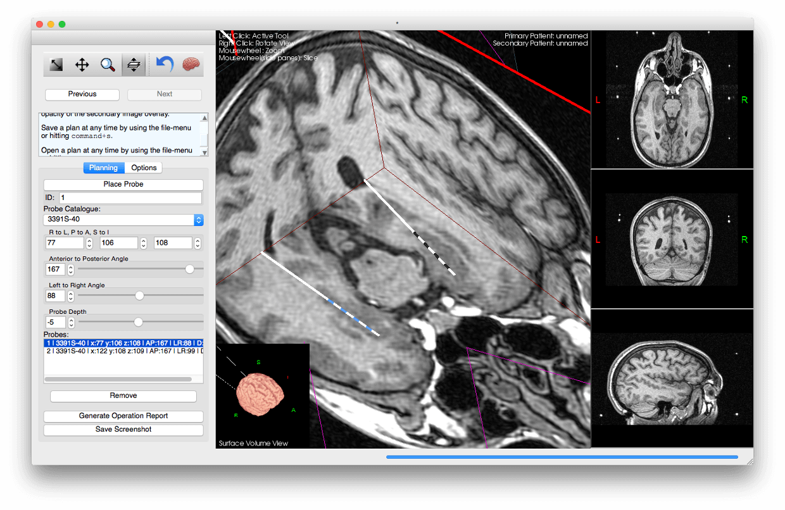

# Overview

Tactics is a prototype application for assigning target coordinates to
locations within the brain, so that neurosurgeons can easily and
precisely target those locations with electrodes that stimulate the
brain in order to provide therapy for certain brain disorders. This
kind of therapy, referred to as deep-brain stimulation (DBS), has been
used for many years to alleviate the symptoms of Parkinson's disease
and dystonia, in is under evaluation for use in treating mental
disorders such as anorexia, obsessive-compulsive disorder, and major
depressive disorder. Tactics aims to increase the efficiency of
planning DBS cases a) by automatically processing the images with
computer-vision techiques to identify the position of the Leksell-G
frame that surgeons use to insert the electrodes into the brain, and
b) by providing an intuitive 3D interface to allow the surgeon to
visualize the positions of the electrodes relative to the structures
in the brain.

# Installation

This project requires:
* [Cross-platform Make (CMake) v2.8.9+](http://www.cmake.org/)
* [GNU Make or equivalent.](https://www.gnu.org/software/make/)
* [GCC or an alternative, reasonably conformant C++ compiler.](https://gcc.gnu.org/)
* [Qt Framework v4.7+](http://www.qt.io/)
* [VTK](http://www.vtk.org/)
* [ITK](http://www.itk.org/)

# Contribution

This project makes an earnest attempt to follow the
[Google C++ Style Guide](http://google-styleguide.googlecode.com/svn/trunk/cppguide.xml).
Please follow the coding style, when you can (for example, don't use
Google style in a VTK file, use VTK style).

Please submit a pull-request on
[Github](https://github.com/Atamai/tactics) to contribute code
directly to the project.

# Acknowledgments

The project structure started as a fork of Michael Aaron Safyan's
[cpp-project-template](https://code.google.com/p/cpp-project-template/).
